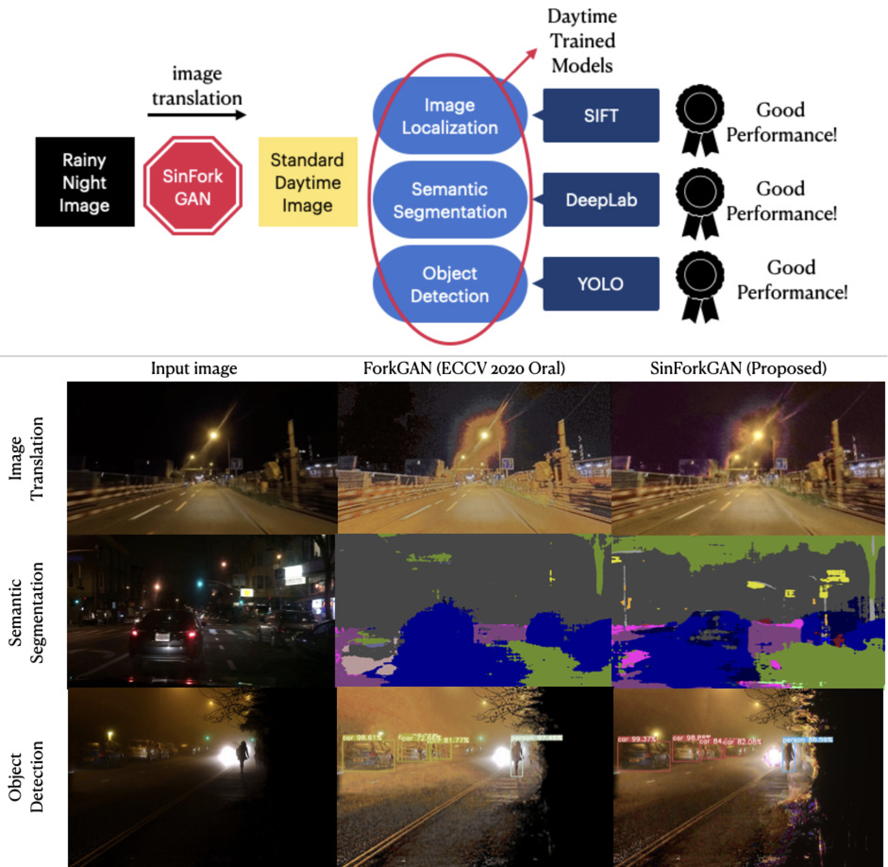

# ForkGAN with Single Rainy Night Images: Leveraging the RumiGAN to See into the Rainy Night

By Seri Lee, Department of Engineering, Seoul National University

This repository contains the code for training and testing the SinForkGAN model.
This project was conducted as a final project for the course "Topics in Artificial Intelligence: Advanced GANs" in Seoul National University.
The paper was submitted for 2021 ACML. 
For more information about the course, please refer to our [instructor](https://github.com/yunjey)'s github page.

- [Project Page](https://sites.google.com/snu.ac.kr/sinforkgan/overview)
- [Paper](https://sally20921.github.io/doc/sinforkgan.pdf)

## Dependency 
We use python3 (3.6), and python2 is not supported. 

## Table of contents 
1. [Overview](#1)
3. [Dataset](#2)
4. [SinForkGAN Model](#3)
5. [Dependency](#4)
6. [Install](#5)
7. [How to use](#6)
8. [Evaluation Metric](#7)
9. [Downstream Tasks](#8)
10. [Reference](#9)
11. [Contact](#20)

<a name="1"></a>
## Overview



<a name="2"></a>
## Dataset
SinForkGAN model is built upon 4 different night/rainy dataset. 

1. **Dark Zurich Dataset** (ICCV 2019): provides 2,416 nighttime images along with the respective GPS coordinates
of the camera for each image used to construct cross-time correspondences for evaluation on localization task.
- 

2. [**RaidaR**](https://sites.google.com/site/alimahdaviamiri/projects/raidar) (CVPR 2020): a rich annotated dataset of rainy street scenes. 5,000 images provide semantic segmentations
and 3,658 provide object instance segementations. 
- 

3. [**BDD100K**](https://bair.berkeley.edu/blog/2018/05/30/bdd/) (CVPR2017): 100,000 video clips in multiple cities, weathers and multiple times of day. 27,971 night images for training and 3,929 night images for evaluation.
- 

4. **ExDark** (CVIU 2018): 7,7863 low-light images from very low-light environments to twilight with 12 object classes annotated on local object bounding boxes. 
- 

<a name="3"></a>
## SinForkGAN Model
SinForkGAN model effectively learns and tests nighttime rainy images and translates them into standard daytime images in an unsupervised way. Note that this model is designed for subsequent computer vision task (e.g. image retrieval, localization, semantic segmentation, object detection) rather than human vision. Some noise that are crucially degrading for machine vision might not be for the natural eye. 

It also differs from single image dehazing/denoising methods in that it is trained and tested on real-world dataset. Unsupervised single image dehazing/denoising methods tend to fail under real-world circumstances where noises are different from synthetic dataset, and our problem setting (e.g. rainy night) is a much more challenging setting than just simple image denoising. 


<a name="4"></a>
## Dependency

Python (3.6) is used for training and testing.

<a name="5"></a>
## Install
### For Linux System
```
git clone --recurse-submodules (this repo)
cd $REPO_NAME/code
(use python >= 3.6)
python3 -m venv sinforkgan-env
source sinforkgan-env/bin/activate
pip3 install -r requirements.txt
```
Place the data folder at `$REPO_NAME/datasets'

## Data Folder Structure

Please place the data folder like the following structure.
We change and modify the structure of each dataset using only nighttime/rainy images.
For example, for RaidaR dataset, we only use `0.Rainy` dataset for testing and do away with the folder `1.Sunny`.

- How it looks when you download each dataset
```
code/
  translation/
    train.py
  ...
datasets/
  bdd100k/
   train/
    class_color/
     ...
    raw_images/
     0a1a0c5d-8098f13f.jpg
     ...
   val/
    class_color/
     ...
    raw_images/
     ...
  dark-zurich/
   train/
   val/
    ...
    GOPRO0356_000488_rgb_anon.png
  ex-dark/
    ...
    Bicycle/
    ...
     2015_06850.jpg
    Boat/
    ...
  raidar/
   Part1/
    Part1.1/
     00001593/
      00001593.jpg
   ...
   Part2/
   ...
```

- How you should change it 
```
code/
  translation/
    train.py
datasets/
  bdd100k/
    train/
      0a1z0c5d-8098f13f.jpg
      ...
    val/
    test/
  dark-zurich/
    train/
      GOPRO0356_000488_rgb_anon.png
      ...
    val/
    test/
  ex-dark/
   train/
     2015_06850.jpg
     ...
    val/
    test/
  raidar/
    train/
      00001593.jpg
      ...
    val/
    test/
```
 
(More information will be provided soon)

<a name="6"></a>
## How to use

### Training 
```
cd code/translation 
python3 cli.py train
```

### Evaluation

All the pretrained weights are planned to be provided.
If you don't have the pretrained weights provided or trained in the `./ckpt` directory,
please download them [here](https://sally20921.github.io/weights/README.md)

```
cd code/translatino
python3 cli.py evaluate --ckpt_name=$CKPT_NAME
```

### Demo 

For simple image translation demo, run
```
cd code/translation
python3 cli.py infer --ckpt_name=$CKPT_NAME
```

You can view the translated file in the terminal using `imgcat` in `./test` directory.
```
cd test
./imgcat results/(name/of/file.png)
```

<a name="7"></a>
## Evaluation Metric 
- mIoU: Intersection-over-Union(IoU) measures the overlap between predicted segmentation map and the ground truth, divided by their union. In the case of multiple classes, we take the average of IoU of all classes (i.e., mIoU) to indicate the overall performance of the model. 


<a name="8"></a>
## Downstream Tasks
### Image Localization/Retrieval
We use SIFT algorithm for keypoint detection. Opencv provides a ready-to-use SIFT module. More information about cv::SIFT can be found [here](https://docs.opencv.org/3.4/d7/d60/classcv_1_1SIFT.html). The SIFT detector uses DoG and  4 octaves starting with a two times up-sampled version of the original image, 3 scales per octave, a peak threshold of , an edge threshold of 10, and a maximum of 2 detected orientations per keypoint location. These values have been optimized for the purpose of SFM and are, e.g., used as defaults in COLMAP.

#### Pipeline
1. Detect keypoints using SIFT Detector, compute the descriptors
2. Matching descriptor vectors with a BF based matcher 
3. Filter matches using the Lowe's ratio test (ratio_thresh = 0.7)
4. draw matches 


### Semantic Segmentation
DeepLabV3 model pretrained on the Cityscapes dataset is used for the semantic segmentation task. The source code that we used for this task has been deleted, unfortunately. We will soon find an alternative for testing. 

Raidar dataset can be downloaded [here](https://github.com/aarezzou/RaidaR)


BDD100K dataset can be downloaded [here](https://bdd-data.berkeley.edu/)


### Object Detection
YOLOv3-tiny model pretrained on the PASCAL VOC 2007 + 2012 dataset is used for the object detection task. Source code can be found [here](https://github.com/sally20921/YOLOv3-PyTorch). mAP is measured at .5 IOU. The author of [YOLOv3](https://pjreddie.com/darknet/yolo/) notes that you can easily tradeoff between speed and accuracy by changing the size of the model. We choose the YOLOv3-tiny for our purpose. We set the detection threshold to 0.5.


<a name="9"></a>
## Reference
```
@article{enlighten,
  author={Jiang, Yifan and Gong, Xinyu and Liu, Ding and Cheng, Yu and Fang, Chen and Shen, Xiaohui and Yang, Jianchao and Zhou, Pan and Wang, Zhangyang},
  journal={IEEE Transactions on Image Processing}, 
  title={EnlightenGAN: Deep Light Enhancement Without Paired Supervision}, 
  year={2021}
}


@article{wei2018deep,
  title={Deep retinex decomposition for low-light enhancement},
  author={Wei, Chen and Wang, Wenjing and Yang, Wenhan and Liu, Jiaying},
  journal={arXiv preprint arXiv:1808.04560},
  year={2018}
}

@article{goodfellow2014,
  title={Generative adversarial networks},
  author={Goodfellow, Ian J and Pouget-Abadie, Jean and Mirza, Mehdi and Xu, Bing and Warde-Farley, David and Ozair, Sherjil and Courville, Aaron and Bengio, Yoshua},
  journal={arXiv preprint arXiv:1406.2661},
  year={2014}
}

@inproceedings{srgan2017,
  title={Photo-realistic single image super-resolution using a generative adversarial network},
  author={Ledig, Christian and Theis, Lucas and Husz{\'a}r, Ferenc and Caballero, Jose and Cunningham, Andrew and Acosta, Alejandro and Aitken, Andrew and Tejani, Alykhan and Totz, Johannes and Wang, Zehan and others},
  booktitle={Proceedings of the IEEE conference on computer vision and pattern recognition},
  pages={4681--4690},
  year={2017}
}

@article{wu2021contrastive,
  title={Contrastive Learning for Compact Single Image Dehazing},
  author={Wu, Haiyan and Qu, Yanyun and Lin, Shaohui and Zhou, Jian and Qiao, Ruizhi and Zhang, Zhizhong and Xie, Yuan and Ma, Lizhuang},
  journal={arXiv preprint arXiv:2104.09367},
  year={2021}
}

@inproceedings{johnson2016perceptual,
  title={Perceptual losses for real-time style transfer and super-resolution},
  author={Johnson, Justin and Alahi, Alexandre and Fei-Fei, Li},
  booktitle={European conference on computer vision},
  pages={694--711},
  year={2016},
  organization={Springer}
}

@inproceedings{mao2017least,
  title={Least squares generative adversarial networks},
  author={Mao, Xudong and Li, Qing and Xie, Haoran and Lau, Raymond YK and Wang, Zhen and Paul Smolley, Stephen},
  booktitle={Proceedings of the IEEE international conference on computer vision},
  pages={2794--2802},
  year={2017}
}

@inproceedings{liu2019unsupervised,
  title={Unsupervised Single Image Dehazing via Disentangled Representation},
  author={Liu, Qian},
  booktitle={Proceedings of the 3rd International Conference on Video and Image Processing},
  pages={106--111},
  year={2019}
}

@article{zheng2020forkgan,
  title={ForkGAN: Seeing into the rainy night},
  author={Zheng, Ziqiang and Wu, Yang and Han, Xinran and Shi, Jianbo},
  year={2020}
}

@inproceedings{tsai2018learning,
  title={Learning to adapt structured output space for semantic segmentation},
  author={Tsai, Yi-Hsuan and Hung, Wei-Chih and Schulter, Samuel and Sohn, Kihyuk and Yang, Ming-Hsuan and Chandraker, Manmohan},
  booktitle={Proceedings of the IEEE conference on computer vision and pattern recognition},
  pages={7472--7481},
  year={2018}
}

@article{asokan2020teaching,
  title={Teaching a GAN What Not to Learn},
  author={Asokan, Siddarth and Seelamantula, Chandra Sekhar},
  journal={arXiv preprint arXiv:2010.15639},
  year={2020}
}

@inproceedings{zhu2017unpaired,
  title={Unpaired image-to-image translation using cycle-consistent adversarial networks},
  author={Zhu, Jun-Yan and Park, Taesung and Isola, Phillip and Efros, Alexei A},
  booktitle={Proceedings of the IEEE international conference on computer vision},
  pages={2223--2232},
  year={2017}
}

@inproceedings{krull2019,
  title={Noise2void-learning denoising from single noisy images},
  author={Krull, Alexander and Buchholz, Tim-Oliver and Jug, Florian},
  booktitle={Proceedings of the IEEE/CVF Conference on Computer Vision and Pattern Recognition},
  pages={2129--2137},
  year={2019}
}

@inproceedings{noise2self,
  title={Noise2self: Blind denoising by self-supervision},
  author={Batson, Joshua and Royer, Loic},
  booktitle={International Conference on Machine Learning},
  pages={524--533},
  year={2019},
  organization={PMLR}
}

@article{neighbor2neighbor,
  title={Neighbor2Neighbor: Self-Supervised Denoising from Single Noisy Images},
  author={Huang, Tao and Li, Songjiang and Jia, Xu and Lu, Huchuan and Liu, Jianzhuang},
  journal={arXiv preprint arXiv:2101.02824},
  year={2021}
}

@article{versatile,
  title={Versatile auxiliary classifier with generative adversarial network (vac+ gan), multi class scenarios},
  author={Bazrafkan, Shabab and Corcoran, Peter},
  journal={arXiv preprint arXiv:1806.07751},
  year={2018}
}

@inproceedings{conditional,
  title={Conditional image synthesis with auxiliary classifier gans},
  author={Odena, Augustus and Olah, Christopher and Shlens, Jonathon},
  booktitle={International conference on machine learning},
  pages={2642--2651},
  year={2017},
  organization={PMLR}
}

@inproceedings{mao2017least,
  title={Least squares generative adversarial networks},
  author={Mao, Xudong and Li, Qing and Xie, Haoran and Lau, Raymond YK and Wang, Zhen and Paul Smolley, Stephen},
  booktitle={Proceedings of the IEEE international conference on computer vision},
  pages={2794--2802},
  year={2017}
}

@inproceedings{zhu2017unpaired,
  title={Unpaired image-to-image translation using cycle-consistent adversarial networks},
  author={Zhu, Jun-Yan and Park, Taesung and Isola, Phillip and Efros, Alexei A},
  booktitle={Proceedings of the IEEE international conference on computer vision},
  pages={2223--2232},
  year={2017}
}

@misc{jin2018unsupervised,
      title={Unsupervised Single Image Deraining with Self-supervised Constraints}, 
      author={Xin Jin and Zhibo Chen and Jianxin Lin and Zhikai Chen and Wei Zhou},
      year={2018}
}
      
,@misc{sakaridis2019guided,
      eprint={1811.08575},
      archivePrefix={arXiv},
      primaryClass={cs.CV}
}

@misc{dark-zurich,
      title={Guided Curriculum Model Adaptation and Uncertainty-Aware Evaluation for Semantic Nighttime Image Segmentation}, 
      author={Christos Sakaridis and Dengxin Dai and Luc Van Gool},
      year={2019},
      eprint={1901.05946},
      archivePrefix={arXiv},
      primaryClass={cs.CV}
}

@misc{raidar,
      title={RaidaR: A Rich Annotated Image Dataset of Rainy Street Scenes}, 
      author={Jiongchao Jin and Arezou Fatemi and Wallace Lira and Fenggen Yu and Biao Leng and Rui Ma and Ali Mahdavi-Amiri and Hao Zhang},
      year={2021},
      eprint={2104.04606},
      archivePrefix={arXiv},
      primaryClass={cs.CV}
}

@misc{bdd100k,
      title={BDD100K: A Diverse Driving Dataset for Heterogeneous Multitask Learning}, 
      author={Fisher Yu and Haofeng Chen and Xin Wang and Wenqi Xian and Yingying Chen and Fangchen Liu and Vashisht Madhavan and Trevor Darrell},
      year={2020},
      eprint={1805.04687},
      archivePrefix={arXiv},
      primaryClass={cs.CV}
}

@misc{exdark,
      title={Getting to Know Low-light Images with The Exclusively Dark Dataset}, 
      author={Yuen Peng Loh and Chee Seng Chan},
      year={2018},
      eprint={1805.11227},
      archivePrefix={arXiv},
      primaryClass={cs.CV}
}

```
- ForkGAN [paper](https://github.com/sally20921/SinForkGAN/files/6580597/forkgan.pdf)[github](https://github.com/zhengziqiang/ForkGAN)
- ToDayGAN [paper]()[github]()
- EnlightenGAN [paper]()[github]()
- RumiGAN[paper]()[github]()
- YOLOV3-tiny [github]((https:// github.com/Lornatang /YOLOv3-PyTorch)

<a name="10"></a>
## Contact Me

To contact me, send an email to sally20921@snu.ac.kr

